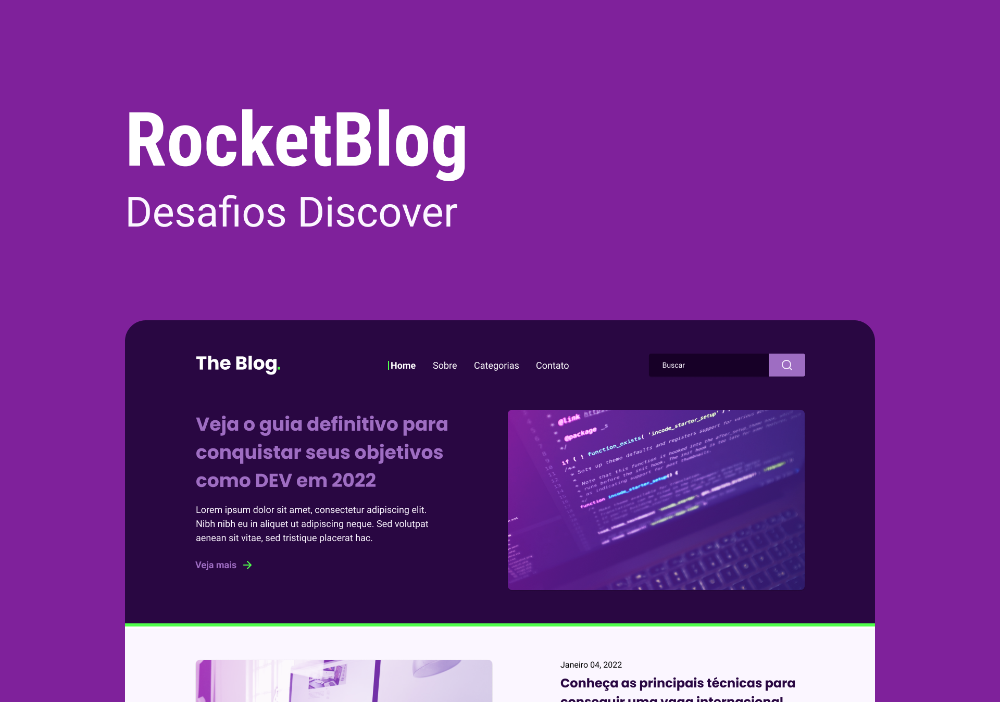

<h1 align="center"> Desenvolver uma homepage para um blog </h1>

 Desafio Discover, promovido pela Rocketseat para ensino de tecnologias WEB.  

  <a href="#-tecnologias">Tecnologias</a>&nbsp;&nbsp;&nbsp;|&nbsp;&nbsp;&nbsp;
  <a href="#-layout">Layout</a>&nbsp;&nbsp;&nbsp;|&nbsp;&nbsp;&nbsp;
   <a href="#-vercel">Blog Dev vercel.app</a>&nbsp;&nbsp;&nbsp;|&nbsp;&nbsp;&nbsp;
  <a href="#memo-licença">Licença</a>

  

 

  

## 🚀 Tecnologias

Esse projeto foi desenvolvido com as seguintes tecnologias:

- HTML
- React
- Tailwind CSS
- Figma

## 🔖 Layout

Você pode visualizar o layout do projeto através [DESSE LINK](https://www.figma.com/file/QU9jRehwobQA7cFrieEAbC/DD-%2F-RocketBlog-(Copy)?type=design&node-id=0-1&t=QoEN3AABPY5qUOsj-0). É necessário ter conta no [Figma](https://figma.com) para acessá-lo.

## 🔖 Vercel

Você pode visualizar o projeto na vercel através [DESSE LINK](https://blog-dev-liard.vercel.app/).

---

## :memo: Licença

Esse projeto está sob a licença MIT.
